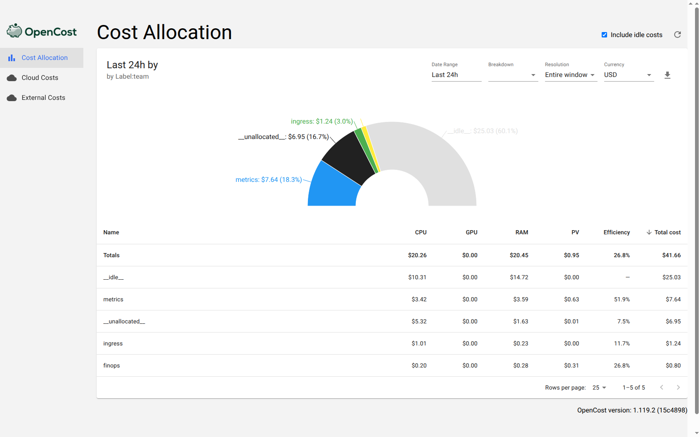
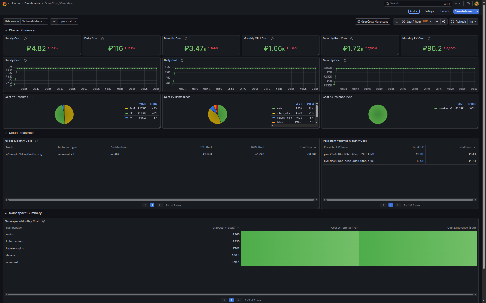
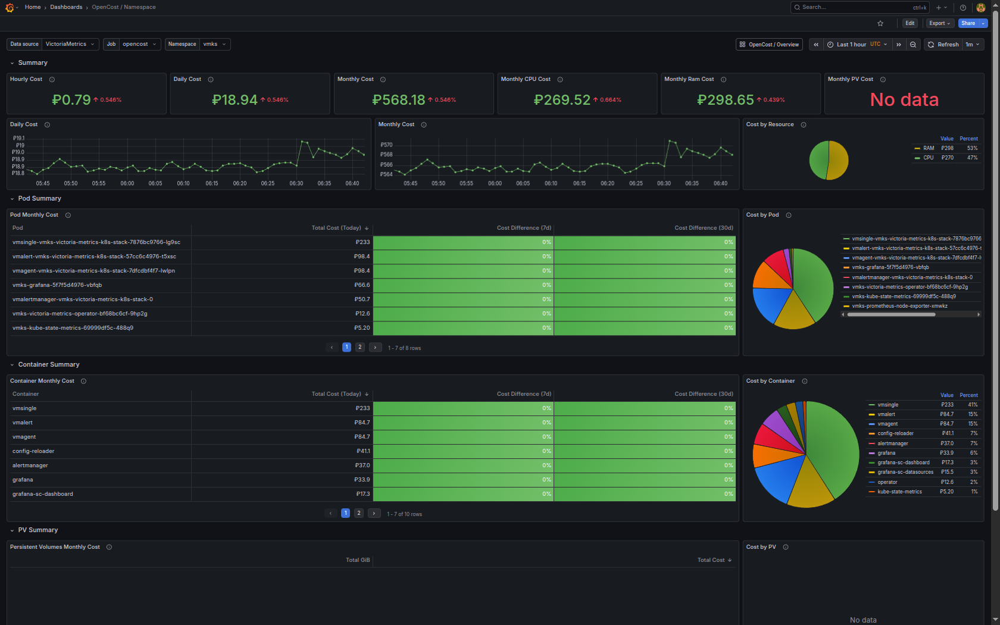
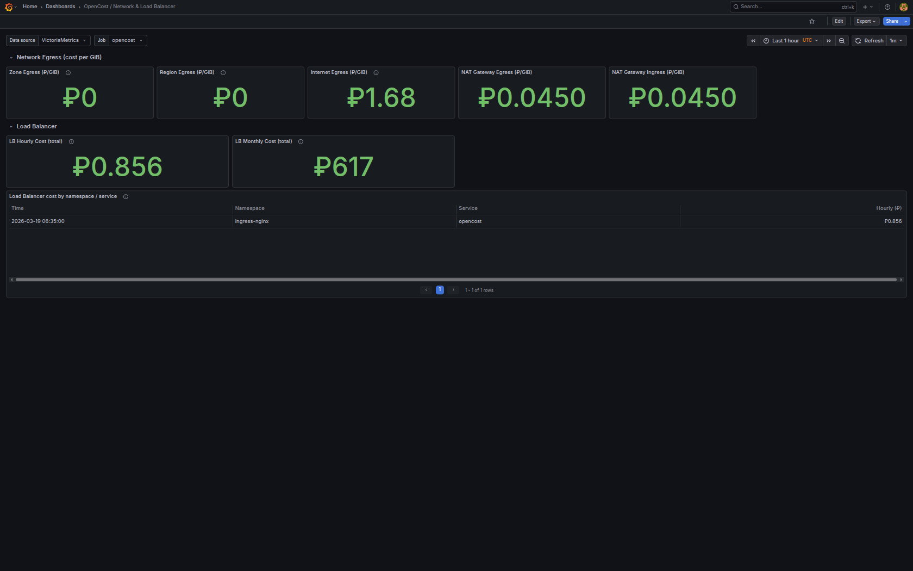
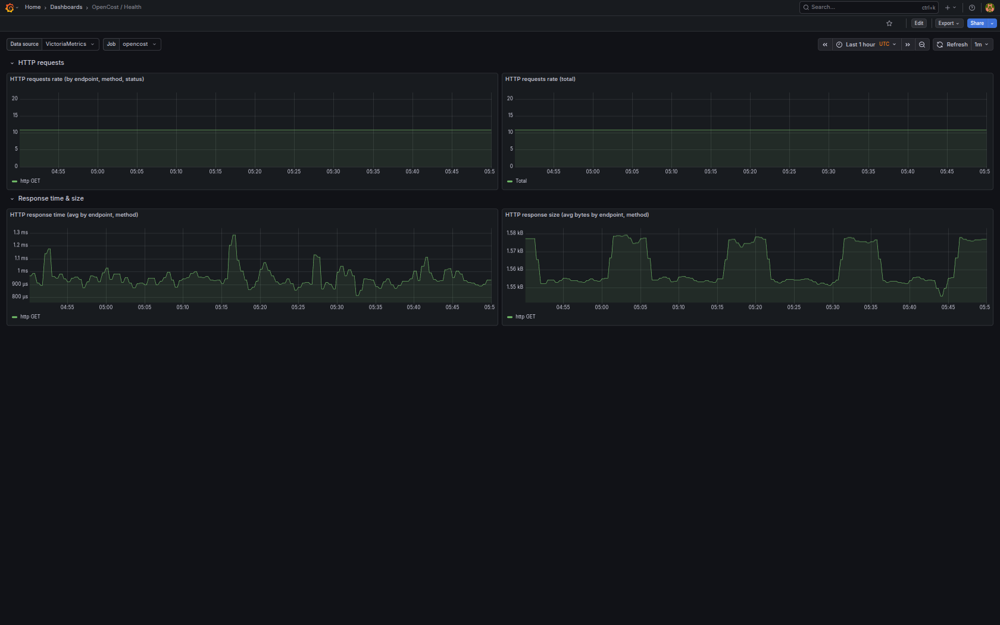

# OpenCost в Yandex Cloud — расчёт стоимости Kubernetes по ценам Yandex Cloud.

## Цели проекта

- **Видимость расходов** — получать расчёт стоимости Kubernetes-кластера (ноды, поды, CPU/RAM/диск) в рублях по ценам Yandex Cloud.
- **Просмотр в мониторинге** — видеть cost-метрики OpenCost в Grafana вместе с остальными метриками кластера.
- **Распределение по командам (FinOps)** — группировать расходы по лейблу `team`.
- **Сверка с биллингом** — при необходимости сравнивать аллокации OpenCost с фактическими списаниями Yandex Cloud (Billing API, детализация).
- **Доступ к cost-данным** — использовать Allocation API и метрики не только в UI/Grafana, но и через MCP для автоматизации и AI-ассистентов.

## Что такое OpenCost

OpenCost — open-source проект для расчёта и визуализации стоимости ресурсов в Kubernetes. Он агрегирует данные об использовании CPU, памяти и диска (ноды, поды, PVC), применяет к ним тарифы и даёт метрики и API для отображения затрат по namespace, deployment, label и т.д. Изначально создан в Kubecost, затем выделен в отдельный проект под CNCF; поддерживает кастомные цены и интеграцию с разными облаками и он-прем-кластерами.

## Зачем OpenCost нужен Prometheus-совместимый TSDB

OpenCost сам не собирает и не хранит метрики. Для расчёта стоимости ему нужна внешняя база временных рядов с Prometheus API, из которой он читает:

- **node-exporter** — использование CPU, памяти, диска на нодах;
- **kube-state-metrics** — запросы/лимиты подов, PVC, состояние нод.

На основе этих метрик OpenCost строит cost-модель и экспортирует свои метрики. Подробнее далее по тексту.


## Использование Prometheus Operator CRD

Используем Prometheus Operator CRD, чтобы не писать конфигурации скрейпинга (scrape) для vmagent вручную. CRD нужен для ServiceMonitor OpenCost: чарт OpenCost создаёт ServiceMonitor в namespace `opencost`, и vmagent (VictoriaMetrics) по нему автоматически скрейпит метрики OpenCost.

```bash
helm upgrade --install prometheus-operator-crds oci://ghcr.io/prometheus-community/charts/prometheus-operator-crds --namespace kube-system --wait --version 27.0.0
```

После появления CRD в кластере чарт OpenCost сможет создать ServiceMonitor.

## Установка VictoriaMetrics Stack

```bash
helm upgrade --install --wait --timeout 10m \
    vmks oci://ghcr.io/victoriametrics/helm-charts/victoria-metrics-k8s-stack \
    --namespace vmks --create-namespace \
    --version 0.72.4 \
    --values vmks-values.yaml
```

Ссылка на исходный код: [vmks-values.yaml](https://github.com/patsevanton/opencost-yandex-cloud/blob/main/vmks-values.yaml).

### Пароль admin Grafana

Grafana входит в VictoriaMetrics Stack. Логин по умолчанию: `admin`. Пароль хранится в секрете Kubernetes:

```bash
kubectl get secret vmks-grafana -n vmks -o jsonpath="{.data.admin-password}" | base64 -d; echo
```

Grafana доступна по адресу http://grafana.apatsev.org.ru.

## Настройка цен для OpenCost

### Billing API Яндекс Облака

Тарифы для OpenCost можно получать через **Billing API** Яндекса: метод [Sku.List](https://yandex.cloud/ru/docs/billing/api-ref/Sku/list) возвращает каталог SKU (тарифных единиц — цены за vCPU, RAM, диск и т.д.). 

Скрипт [scripts/fetch_yandex_sku_prices.py](https://github.com/patsevanton/opencost-yandex-cloud/blob/main/scripts/fetch_yandex_sku_prices.py) может вывести список всех SKU из каталога. Его можно запустить по прямой ссылке из интернета:

```bash
export IAM_TOKEN=$(yc iam create-token)

# Вывести список всех SKU из каталога:
python3 scripts/fetch_yandex_sku_prices.py --list-skus

# Сохранение списка в markdown-файл с таблицей (при локальном запуске):
python3 scripts/fetch_yandex_sku_prices.py --list-skus --output skus.md
```

В файле `skus.md` — markdown-таблица с колонками: `id`, `serviceId`, `pricingUnit`, `price`, `name`.

### Автоматическое создание custom-pricing-configmap.yaml

Скрипт подставляет в ConfigMap цены для **CPU, RAM, storage** (из Billing API), а также **egress** (internetNetworkEgress) и **Load Balancer** (почасовая ставка). При необходимости можно подставить цены из детализации биллинга (CSV): для LB в CSV часто есть ненулевая стоимость, для egress в CSV обычно 0 — тогда берётся тариф из API.

```bash
# Показать подобранные цены (рубли), не менять файлы:
python3 scripts/fetch_yandex_sku_prices.py

# Обновить custom-pricing-configmap.yaml (только API):
python3 scripts/fetch_yandex_sku_prices.py --update custom-pricing-configmap.yaml

# Подставить цены из детализации CSV (где cost > 0): LB почасовая и, при наличии, egress; скрипт дополняет/перезаписывает значения:
python3 scripts/fetch_yandex_sku_prices.py --update custom-pricing-configmap.yaml --csv 20260312-20260331.csv
```

**Egress (zone/region/internet):** в ConfigMap задаются ключи `zoneNetworkEgress`, `regionNetworkEgress`, `internetNetworkEgress` (₽/GiB). В Yandex Cloud платным обычно бывает только исходящий трафик → заполняют `internetNetworkEgress` (из API или skus.md); zone/region можно оставить `"0"`.

**Load Balancer:** ключ `loadBalancer` — почасовая ставка (₽/час), соответствует «Сетевой балансировщик нагрузки» в детализации. Стоимость входящего трафика через LB (LBIngressDataCost, ₽/GiB) и правила маршрутизации в custom pricing OpenCost отдельными ключами не задаются; при запуске с `--csv` скрипт выводит рассчитанную по CSV цену за ГБ входящего трафика для справки.

### Как заполнить custom-pricing-configmap.yaml вручную по данным файла skus.md

**Шаг 1 — какие поля ConfigMap заполнять**

В `custom-pricing-configmap.yaml` в блоке `data:` задаются:

| Ключ ConfigMap | Описание | Единица в биллинге | Пример из детализации |
|----------------|----------|--------------------|------------------------|
| `CPU` | Цена за vCPU (месячная ставка) | core×час (core*hour) | Вычислительные ресурсы обычной BM, Intel Ice Lake, 100% vCPU |
| `RAM` | Цена за ГБ RAM (месячная ставка) | ГБ×час (gbyte*hour) | Вычислительные ресурсы обычной BM, Intel Ice Lake, RAM |
| `storage` | Цена за ГБ диска (месячная ставка) | ГБ×час (gbyte*hour) | Стандартный диск (HDD) |
| `zoneNetworkEgress` | Стоимость egress в зоне (₽/GiB) | — | Обычно 0 |
| `regionNetworkEgress` | Стоимость egress в регионе (₽/GiB) | — | Обычно 0 |
| `internetNetworkEgress` | Стоимость исходящего трафика в интернет (₽/GiB) | gbyte | Исходящий трафик (VPC) |
| `loadBalancer` | Почасовая стоимость LB (₽/час) | hour | Network Load Balancer. Сетевой балансировщик нагрузки |

**Шаг 2 — найти цену за единицу в skus.md**

В файле `skus.md` (таблица) нужно найти строку, где **name** совпадает с **Продуктом** из Яндекс UI, а **pricingUnit** — с **Ед. потребления** (в skus.md единицы вроде `core_hour`, `gbyte_hour`).

Примеры соответствия:

- **CPU** — продукт «Вычислительные ресурсы обычной BM, Intel Ice Lake, 100% vCPU», ед. потребления `core*hour`. В skus.md ищем, например: `Regular VM computing resources, Intel Ice Lake, 100% vCPU` и `core_hour`. Цена за 1 core×час (руб.) × 730 = значение для `CPU`.
- **RAM** — продукт «Вычислительные ресурсы обычной BM, Intel Ice Lake, RAM», ед. `gbyte*hour`. В skus.md: `Regular VM computing resources, Intel Ice Lake, RAM` и `gbyte_hour`. Цена за 1 ГБ×час × 730 = значение для `RAM`.
- **storage (HDD)** — продукт «Стандартный диск (HDD)», ед. `gbyte*hour`. В skus.md ищем `Standard disk drive (HDD)` или аналог с `gbyte_hour`; формула: цена за 1 ГБ×час × 730 = значение для `storage`.

**Шаг 3 — формула для значений**

OpenCost интерпретирует значения в ConfigMap как **месячные** ставки и сам делит на 730. Поэтому:

```
значение в ConfigMap = цена_за_единицу_из_skus_руб × 730
```

Пример: в skus.md для Regular VM Intel Ice Lake 100% vCPU указано `1.1529 RUB` за `core_hour`. Тогда `CPU = "841.617"` (1.1529 × 730). Аналогично для RAM (0.3074 ₽/ГБ×час → 224.402) и storage (0.0045 ₽/ГБ×час для HDD → 3.285).

**Проверка:** в детализации «Стоимость потребления» за период = (объём потребления в единицах) × (цена за единицу). Цена за единицу можно проверить: стоимость потребления / объём (например, 55.34 ₽ / 48 core×час ≈ 1.1529 ₽/core×час).

При сверке с экспортированным CSV файлом детализации биллинга: **CPU** и **RAM** совпали с фактическими ставками (стоимость потребления / объём). Для **storage** (Стандартный диск HDD, sku `dn2al287u6jr3a710u8g`) наблюдается небольшое расхождение: в каталоге skus.md указано 0.0045 ₽/ГБ×час, по факту из CSV выходит около 0.00445 ₽/ГБ×час (в пределах округления). Для расчётов можно использовать либо значение из skus.md, либо уточнённое по детализации.

**Как обновить custom-pricing-configmap.yaml**

- **Вручную:** откройте `custom-pricing-configmap.yaml`, в блоке `data:` замените значения ключей `CPU`, `RAM`, `storage` по формуле **цена_из_skus × 730** (округлить до 3 знаков после запятой). Пример для цен из таблицы выше:
  - `CPU: "841.617"`   (1.1529 × 730)
  - `RAM: "224.402"`   (0.3074 × 730)
  - `storage: "3.285"` для HDD (0.0045 × 730)
- **Egress и LB:** `internetNetworkEgress` — цена за 1 ГБ исходящего трафика (из skus.md или API; в детализации CSV часто cost=0). `loadBalancer` — почасовая ставка NLB: в CSV по продукту «Сетевой балансировщик нагрузки» при cost>0 можно взять **стоимость / объём (часы)** (например, 20.55456 / 24 ≈ 0.856 ₽/час).


Для **egress** и **loadBalancer** значения задаются в тех же единицах, что в биллинге: ₽/GiB и ₽/час (не умножать на 730). Остальные позиции детализации (публичный IP, Cloud DNS, мастер Kubernetes и т.д.) в custom pricing OpenCost отдельными ключами не задаются.

## Установка OpenCost

1. Создайте namespace и примените ConfigMap с кастомными ценами **до** установки OpenCost. В [issue #240](https://github.com/opencost/opencost-helm-chart/issues/240) описано, что данные в ConfigMap должны быть в виде плоских ключей в `data:`, иначе OpenCost их не прочитает:

```bash
kubectl create namespace opencost --dry-run=client -o yaml | kubectl apply -f -
kubectl apply -f custom-pricing-configmap.yaml
```

2. Установите OpenCost из OCI-репозитория:

```bash
helm upgrade --install --wait \
  opencost oci://ghcr.io/opencost/charts/opencost \
  --namespace opencost \
  --version 2.5.10 \
  --values opencost-values.yaml
```

Ссылка на исходный код: [opencost-values.yaml](https://github.com/patsevanton/opencost-yandex-cloud/blob/main/opencost-values.yaml).

3. После установки OpenCost будет доступен по адресу http://opencost.apatsev.org.ru. Перед использованием подождите около 10 минут — за это время OpenCost соберёт необходимые метрики из системы.

**Примечание (валюта в UI):** по умолчанию веб-интерфейс показывает USD. Переключить на RUB можно в самом UI, но при новом заходе снова будет USD — выбор не сохраняется. Валюта в UI **не** берётся из ConfigMap (ConfigMap задаёт только расчёты бэкенда); в текущих версиях OpenCost задать RUB по умолчанию через конфиг или Ingress нельзя. Чтобы сразу открывать в рублях, используйте ссылку с параметром: `http://opencost.apatsev.org.ru?currency=RUB`.


## Стоимость по командам (team cost)

OpenCost позволяет группировать расходы по командам, даже если у команды несколько namespace. Для этого используется агрегация по Kubernetes-лейблу через параметр `aggregate=label:<имя_лейбла>`.

### Настройка

Лейбл, по которому выполняется группировка, в этом проекте (`team`), должен быть установлен **на самом Pod**. Установка лейбла только на объект `Deployment` / `StatefulSet` / `DaemonSet` (в их `metadata.labels`) или только на `Namespace` **не позволяет** группировать расходы по командам — OpenCost учитывает только лейблы на подах.

В этом проекте уже настроены лейблы для группировки инфраструктурных затрат:
- **Victoria Metrics K8s Stack** (`vmks-values.yaml`): поды vmsingle, vmagent, vmalert, alertmanager, grafana, node-exporter, kube-state-metrics и victoria-metrics-operator помечены `team: metrics` (через `spec.podMetadata.labels` для CR-компонентов и `podLabels` для подчартов).
- **OpenCost** (`opencost-values.yaml`): под OpenCost помечен `team: finops`.

### Агрегация в UI

В веб-интерфейсе OpenCost есть выпадающий список **«Aggregate by»** (Namespace, Deployment, Pod и т.д.). Варианта «по лейблу team» в стандартной сборке может не быть — его можно открыть **через URL**, добавив параметр `agg=label:team`:

<http://opencost.apatsev.org.ru/allocation?window=today&agg=label:team&acc=true>



Так откроется отчёт за выбранный период (в примере URL — за сегодня), сгруппированный по командам (включая `metrics` и `finops`). Важно: в URL веб-интерфейса используется параметр `agg`, а в API и MCP для той же логики используется `aggregate=label:team`.

## Скрейпинг метрик OpenCost

OpenCost не только читает метрики из VictoriaMetrics, но и **отдаёт свои** (`node_cpu_hourly_cost`, `container_cpu_allocation` и др.) на порту 9003 (`/metrics`). `ServiceMonitor` сам метрики не создаёт, а лишь описывает для `vmagent`, как их скрейпить. Эти метрики должны попадать в VictoriaMetrics; иначе в TSDB не будет cost-метрик, и Grafana/PromQL-запросы к ним будут возвращать `No data`.

### Дублирование метрик kube_* и опции EMIT_KSM_V1_*

Эндпоинт OpenCost `/metrics` по умолчанию отдаёт те же метрики, что и **kube-state-metrics** (`kube_pod_container_status_running`, `kube_pod_container_resource_requests`, `kube_node_status_*` и др.). Если vmagent скрейпит и OpenCost, и kube-state-metrics, в VictoriaMetrics одни и те же ряды попадают из двух источников — запросы вида `sum(kube_pod_container_status_running)` дают **удвоенные** значения. Удвоенные значения вредны: искажают дашборды, агрегаты и любые расчёты, опирающиеся на эти метрики. Подробнее: [opencost/opencost#1465](https://github.com/opencost/opencost/issues/1465).

В этом проекте предполагается, что **kube-state-metrics всегда есть** (он входит в VictoriaMetrics K8s Stack). Ниже — опции в `opencost-values.yaml`, которые отключают дубликаты.

#### Отключение дубликатов KSM в opencost-values.yaml

В `opencost-values.yaml` заданы:

| Переменная | Значение | Смысл |
|------------|----------|--------|
| `EMIT_KSM_V1_METRICS` | `"false"` | Не отдавать полный набор KSM-метрик на `/metrics`. |
| `EMIT_KSM_V1_METRICS_ONLY` | `"true"` | Отдаются метрики, которые не пересекаются по имени и не дублируются с kube-state-metrics. |

## Дашборды Grafana для OpenCost

Ниже приведены ссылки на шесть дашбордов. Скриншоты сохраняйте в каталог `images/grafana-dashboards/` под именами из столбца «Скриншот»; в разделе [Метрики, которые экспортирует OpenCost](#метрики-которые-экспортирует-opencost) для каждого дашборда есть плейсхолдер изображения и список используемых метрик.

| Файл | GitHub | Описание | Скриншот |
|------|--------|----------|----------|
| **opencost-overview.json** | [ссылка](https://github.com/patsevanton/opencost-yandex-cloud/blob/main/grafana-dashboards/opencost-overview.json) | OpenCost / Overview (Grafana.com ID 22208) | `opencost-overview.png` |
| **opencost-namespace.json** | [ссылка](https://github.com/patsevanton/opencost-yandex-cloud/blob/main/grafana-dashboards/opencost-namespace.json) | OpenCost / Namespace (Grafana.com ID 22252) | `opencost-namespace.png` |
| **opencost-cost-reporter-basic-overview.json** | [ссылка](https://github.com/patsevanton/opencost-yandex-cloud/blob/main/grafana-dashboards/opencost-cost-reporter-basic-overview.json) | Cost reporter — базовый обзор | `opencost-cost-reporter-basic.png` |
| **opencost-cost-reporter-detailed-overview.json** | [ссылка](https://github.com/patsevanton/opencost-yandex-cloud/blob/main/grafana-dashboards/opencost-cost-reporter-detailed-overview.json) | Cost reporter — детальный обзор | `opencost-cost-reporter-detailed.png` |
| **opencost-network-lb.json** | [ссылка](https://github.com/patsevanton/opencost-yandex-cloud/blob/main/grafana-dashboards/opencost-network-lb.json) | OpenCost / Network & Load Balancer (сеть, NAT, LB) | `opencost-network-lb.png` |
| **opencost-health.json** | [ссылка](https://github.com/patsevanton/opencost-yandex-cloud/blob/main/grafana-dashboards/opencost-health.json) | OpenCost / Health (HTTP-метрики) | `opencost-health.png` |

### Суть исправлений

**Проблема:** в дашбордах **opencost-overview.json** и **opencost-namespace.json** на панелях Hourly/Daily/Monthly Cost и PV возникало `No data`. Причина: метрика `kube_persistentvolume_capacity_bytes` в VictoriaMetrics K8s Stack поставляется **kube-state-metrics** (`job="kube-state-metrics"`), а не OpenCost (`job="opencost"`). Переменная `Job` в дашбордах берётся из `opencost_build_info`, то есть по умолчанию `opencost`. В оригинальных запросах стояло `kube_persistentvolume_capacity_bytes{job=~"$job"}`, поэтому при `Job = opencost` результат был пустым.

**Что сделано:** во всех запросах, где используется `kube_persistentvolume_capacity_bytes`, в фильтре явно указан источник `job="kube-state-metrics"`. Остальные метрики в этих дашбордах (стоимость нод, `pv_hourly_cost` и т.д.) по-прежнему фильтруются по `job=~"$job"` (opencost).

В **opencost-namespace.json** привязка PV к namespace делается через `kube_persistentvolumeclaim_info`. Эта метрика в стеке тоже приходит от kube-state-metrics; в текущей версии дашборда для неё оставлен фильтр `job=~"$job"`. Если на панелях PV по namespace появляется `No data`, в запросах для `kube_persistentvolumeclaim_info` нужно подставить `job="kube-state-metrics"` вместо `$job`.

**Дашборды без правок:** в **opencost-cost-reporter-basic-overview.json** и **opencost-cost-reporter-detailed-overview.json** метрики PV (kube_persistentvolume_*) не используются — правка не нужна. В **opencost-network-lb.json** и **opencost-health.json** запросы идут только к метрикам OpenCost с `job=~"$job"` — тоже без изменений.

Переменную `Job` в дашборде оставляйте `opencost`.

### Валюта в панелях

Дашборды по умолчанию показывают единицу **currencyUSD**. При кастомных ценах в рублях (RUB) числовые значения в метриках уже в рублях; подпись единицы в панели при необходимости можно изменить в настройках панели (Field → Unit).

## Метрики, которые экспортирует OpenCost

Запросы за прошлые периоды (день, месяц) выполняются через PromQL по уже сохранённым данным в TSDB. Без Prometheus-совместимого хранилища OpenCost не из чего считать стоимость. В этом репозитории в качестве TSDB используется VictoriaMetrics (совместима с Prometheus API).

OpenCost отдаёт метрики на порту **9003** (`/metrics`). Ниже для каждого дашборда указаны место для скриншота и метрики OpenCost, которые он использует. При кастомных ценах в рублях (`currency: RUB`) значения cost-метрик — в **₽/час** (или ₽/GiB для egress), а не в USD.

### OpenCost Overview



**Файл скриншота:** `images/grafana-dashboards/opencost-overview.png`

**Метрики:** стоимость нод (`node_cpu_hourly_cost`, `node_ram_hourly_cost`, `node_gpu_hourly_cost`, `node_total_hourly_cost`), количество и тип нод (`node_gpu_count`, `kubecost_node_is_spot`), аллокации контейнеров (`container_cpu_allocation`, `container_memory_allocation_bytes`), хранилище (`pv_hourly_cost`, для объёмов — `kube_persistentvolume_capacity_bytes` от kube-state-metrics), Load Balancer (`kubecost_load_balancer_cost`), управление кластером (`kubecost_cluster_management_cost`). Панели: Hourly/Daily/Monthly Cost, Cost by Namespace/Instance Type, Nodes/PV/LB Monthly Cost, GPU/Spot блок.

### OpenCost Namespace



**Файл скриншота:** `images/grafana-dashboards/opencost-namespace.png`

**Метрики:** стоимость нод (`node_cpu_hourly_cost`, `node_ram_hourly_cost`), аллокации по namespace/pod/container (`container_cpu_allocation`, `container_memory_allocation_bytes`, `container_gpu_allocation`, `pod_pvc_allocation`), хранилище (`pv_hourly_cost`). Панели: Hourly/Daily/Monthly Cost по namespace, Monthly CPU/RAM, Cost by Resource/Pod/Container, PV Summary, GPU & PVC allocation.

### OpenCost Cost reporter — базовый обзор


**Файл скриншота:** `images/grafana-dashboards/opencost-cost-reporter-basic.png`

**Метрики:** стоимость нод (`node_cpu_hourly_cost`, `node_ram_hourly_cost`, `node_total_hourly_cost`), аллокации (`container_cpu_allocation`, `container_memory_allocation_bytes`). Панели: Average Daily, Cluster Hour Cost, Estimative Monthly, Top 20 Namespaces/Containers/Pods, Hour Cost by Namespace/Container, Relative price, Standard Variation.

### OpenCost Cost reporter — детальный обзор


**Файл скриншота:** `images/grafana-dashboards/opencost-cost-reporter-detailed.png`

**Метрики:** стоимость нод (`node_cpu_hourly_cost`, `node_ram_hourly_cost`, `node_total_hourly_cost`), аллокации (`container_cpu_allocation`, `container_memory_allocation_bytes`), хранилище (`pv_hourly_cost`). Панели: Top 20 by Namespace/Container, Hour Cost, Live Month/Day/Hour Price, Hour Price by App, AVG/Cluster Hour/Estimative Cluster Cost, PVCs (EBS).

### OpenCost Network & Load Balancer



**Файл скриншота:** `images/grafana-dashboards/opencost-network-lb.png`

**Метрики:** egress по зоне/региону/интернету (`kubecost_network_zone_egress_cost`, `kubecost_network_region_egress_cost`, `kubecost_network_internet_egress_cost`), NAT Gateway (`kubecost_network_nat_gateway_egress_cost`, `kubecost_network_nat_gateway_ingress_cost`), Load Balancer (`kubecost_load_balancer_cost`). Панели: Zone/Region/Internet Egress (₽/GiB), NAT Gateway Egress/Ingress, LB Hourly/Monthly Cost по namespace/service. *При Ingress (NLB за ingress-nginx) OpenCost может не обнаруживать LB — метрика бывает пустой.*

### OpenCost Health



**Файл скриншота:** `images/grafana-dashboards/opencost-health.png`

**Метрики:** HTTP-метрики сервиса OpenCost: `kubecost_http_requests_total` (число запросов по endpoint/method/status), `kubecost_http_response_time_seconds` (время ответа), `kubecost_http_response_size_bytes` (размер ответа). Панели: HTTP requests rate (by endpoint/method/status и total), HTTP response time (avg), HTTP response size (avg bytes).

---

Примеры PromQL: месячная стоимость всех нод — `sum(node_total_hourly_cost) * 730`; стоимость CPU+RAM по namespace — см. [документацию OpenCost](https://opencost.io/docs/integrations/metrics/).

Подключение OpenCost через MCP (для AI-ассистентов) описано в разделе [Подключение MCP OpenCost](#подключение-mcp-opencost) ниже.

## Биллинг Yandex Cloud и интеграция с OpenCost

### Cloud Costs и External Costs в OpenCost

OpenCost помимо расчёта стоимости Kubernetes (Allocation API) предоставляет два дополнительных механизма:

| Механизм | Появился | Что учитывает |
|----------|----------|---------------|
| **Cloud Costs** | 1.108.0 | Фактические расходы из billing API облачного провайдера (AWS, GCP, Azure). Показывает реальные списания, а не расчёт по list price. |
| **External Costs** | 1.110.0 | Затраты на сторонние сервисы вне облака: мониторинг (Datadog), SaaS (MongoDB Atlas), AI/API (OpenAI) и т.п. |

**Yandex Cloud** не входит в список поддерживаемых провайдеров Cloud Costs. External Costs не подходит, так как нас интересуют расходы на само облако, а не на сторонние сервисы.

### Yandex Cloud Billing API: почему не поможет с детализацией

Billing API v1 (gRPC/REST) содержит три сервиса:

| Сервис | Что даёт |
|--------|----------|
| `BillingAccountService` | Список аккаунтов, баланс, привязки |
| `SkuService` | Каталог SKU и тарифы (list price) |
| `ServiceService` | Справочник сервисов |

**Ни один из них не предоставляет фактического потребления или списаний.** Нельзя запросить «сколько потрачено за период X на сервис Y» — API отдаёт только баланс, тарифы и список сервисов. Детализация расходов доступна только через экспорт в CSV.

### Доступные способы получения фактических расходов Yandex Cloud

#### CSV-экспорт в Object Storage

Источник: [Экспортировать расширенную детализацию](https://yandex.cloud/ru/docs/billing/operations/get-folder-report).

- **Разовый экспорт** — в консоли биллинга выгрузка за выбранный период в CSV.
- **Регулярный экспорт** — в настройках биллинга задаётся бакет Object Storage, куда ежедневно выгружаются CSV (обновление раз в час). Поресурсная детализация включает `resource_id`, `sku_id`, идентификаторы каталогов, лейблы.

Для программного доступа: настроить экспорт в бакет и читать CSV через S3-совместимый API.

#### Yandex Query

Если детализация уже выгружается в бакет, можно анализировать данные через [Yandex Query](https://yandex.cloud/ru-kz/docs/billing/operations/query-integration): готовые запросы (топ ресурсов, расход по сервисам) и произвольный YQL. Результаты доступны через HTTP API.

### Возможные пути интеграции с OpenCost

| Путь | Тип в OpenCost | Описание |
|------|----------------|----------|
| Кастомный Cloud Costs провайдер | Cloud Costs (`/cloudCost`) | Go-код в ядро OpenCost, читающий CSV из Object Storage (S3-совместимый API). Аналог интеграций AWS (CUR из S3) и Azure (Cost Exports). Требует модификации ядра. |
| OpenCost Plugin | External Costs (`/customCost/*`) | Плагин, читающий CSV из Object Storage или вызывающий Yandex Query HTTP API. Не требует модификации ядра OpenCost. Репозиторий: [opencost-plugins](https://github.com/opencost/opencost-plugins). |

**Итог:** прямого API для получения списаний у Yandex Cloud нет — фактические расходы доступны только через CSV-экспорт в Object Storage. Наиболее реалистичный путь интеграции — **OpenCost Plugin**, читающий CSV-детализацию из Object Storage через S3-совместимый API.


# Подключение MCP OpenCost

В OpenCost встроен MCP-сервер (Model Context Protocol). Он предоставляет инструменты для запроса данных о стоимости кластера: AI-ассистенты (например, Cursor) могут через MCP получать cost-метрики и отвечать на вопросы о расходах.

MCP-сервер по умолчанию включён в OpenCost и слушает порт **8081**.

## Возможности MCP

Через MCP доступны четыре инструмента:

| Инструмент | Назначение |
|------------|------------|
| **get_allocation_costs** | Стоимость по аллокациям (namespace, deployment, pod, container и др.). Агрегация, фильтры, учёт idle/LB, накопление по времени. |
| **get_asset_costs** | Стоимость по активам (ноды, диски, load balancer и т.п.) за заданное окно времени. |
| **get_cloud_costs** | Облачные расходы: по провайдеру, региону, сервису, аккаунту, категории. Агрегация и фильтрация. |
| **get_efficiency** | Эффективность ресурсов: CPU/память (usage/request), рекомендации по rightsizing и оценка потенциальной экономии. Опционально: `buffer_multiplier` (например 1.2 = 20% запас). |

**Общие параметры:** `window` (временное окно, например `"7d"`, `"1d"`, `"30m"`) — обязателен везде. Для аллокаций и облака: `aggregate`, `filter`. Для аллокаций: `include_idle`, `share_idle`, `share_lb`, `step`, `resolution`, `accumulate`.

## Настройка

Добавьте сервер в настройки MCP (Cursor: настройки → MCP). Пример для доступа по вашему поддомену:

```json
{
  "mcpServers": {
    "opencost": {
      "type": "http",
      "url": "http://mcp-opencost.apatsev.org.ru"
    }
  }
}
```

Документация: [OpenCost MCP](https://opencost.io/docs/integrations/mcp/).