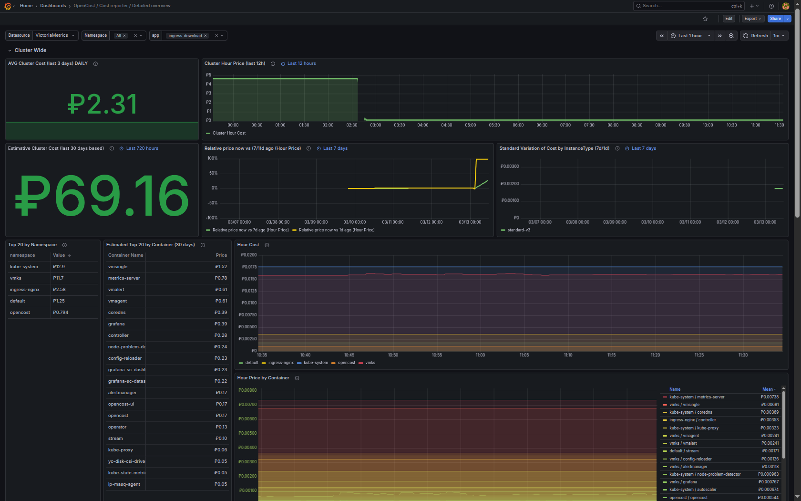
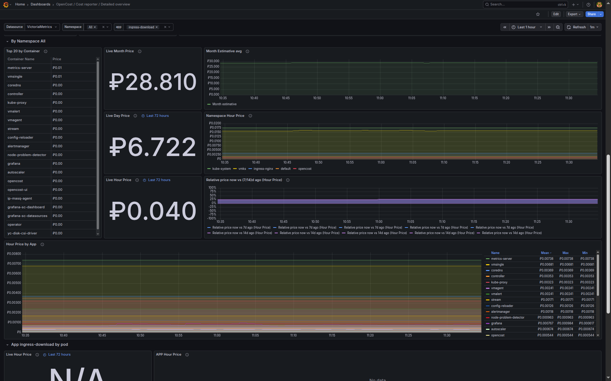

# Скриншоты дашбордов Grafana для OpenCost

Сохраняйте скриншоты дашбордов под следующими именами (они подставлены в README):

| Дашборд | Имя файла |
|---------|-----------|
| OpenCost / Overview | `opencost-overview.png` |
| OpenCost / Namespace | `opencost-namespace.png` |
| Cost reporter — базовый обзор | `opencost-cost-reporter-basic-1.png`, `opencost-cost-reporter-basic-2.png` |
| Cost reporter — детальный обзор | `opencost-cost-reporter-detailed-1.png`, `opencost-cost-reporter-detailed-2.png` |
| OpenCost / Network & Load Balancer | `opencost-network-lb.png` |
| OpenCost / Health | `opencost-health.png` |

Путь в репозитории: `images/grafana-dashboards/<имя_файла>`.

---

## OpenCost / Cost reporter / Detailed overview

